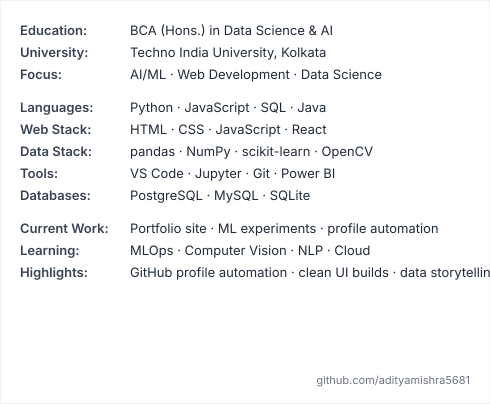

<!--
  Profile README for github.com/adityamishra5681
-->

<table>
<tr>
<td valign="top"></td>
<td valign="top"></td>
</tr>
</table>

## Aditya Mishra

**BCA Student · AI/ML Enthusiast · Web Developer**

 

<!-- animated contribution graph, refreshed daily by the workflow -->

